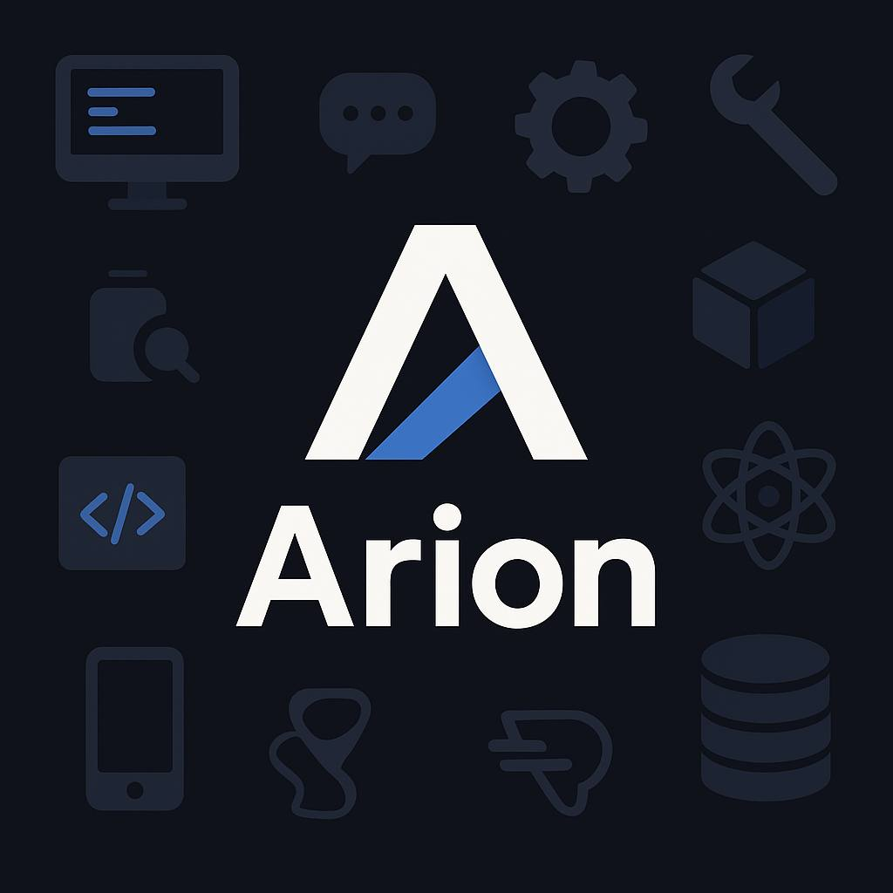

# Arion — Al-помщник в Telegram

**Проект**: AI-помощник в Telegram с использованием OpenAL API/ChatGPT API.
**Бот**: Arion

---

## 📌 Цели проекта

- Создать удобного и умного бота, который может отвечать на вопросы пользователей, помогать с задачами и предоставлять полезную информацию.  
- Повысить доступность ИИ (искуственного интелекта) для обычных пользователей Telegram.
- Сократить время на поиск ответов и автоматизировать повседневные задачи через чат-бота.

---

## ⚙️ Функции бота (на данный момент)

- обработка некоторых команд

---

## Как пользоваться ботом:

В мессенджере Telegram в поиске вбить @arional_bot и начать диалог с ботом с помощью команды /start.

---

## 👨‍💻 Автор

Кирилл
